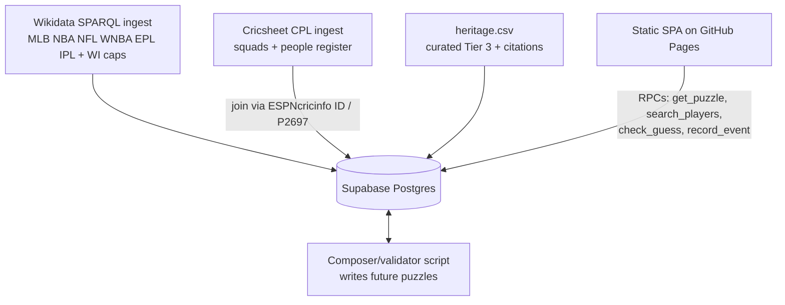
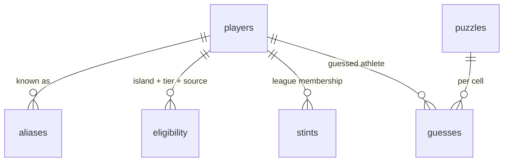

# Caribbean Grid - Plan

## Goal Capsule

- **Objective:** Ship a daily Caribbean sports grid puzzle — islands × professional leagues — as Backcourt's daily-habit audience engine.
- **Product authority:** `caribbean-grid-handoff.md` plus the 2026-07-17 brainstorm dialogue. Core concept locked by owner; single pro-grid mode with a wide league pool confirmed by owner; Olympic mode deferred to v2 as a separate product.
- **Open blockers:** none.
- **Stop conditions:** surface to the owner rather than guessing when a change would alter product scope (grid mechanics, eligibility rules, league pool) or when a data source turns out unusable (Cricsheet join failing at scale, Supabase free-tier limits blocking launch).
- **Execution profile:** greenfield build, no existing code or git history; work proceeds unit-by-unit in dependency order; heritage curation (U4) needs owner input mid-build.

**Product Contract preservation:** Product Contract unchanged from the requirements-only revision confirmed 2026-07-17.

---

## Product Contract

### Summary

A daily 3×3 puzzle where rows are Caribbean islands and columns are three professional leagues drawn from a wide pool — MLB, NBA, NFL, WNBA, EPL, IPL, and CPL (more if density supports). Players name athletes matching island × league under tiered eligibility (born there / national team / heritage). A validator composes each day's grid so every cell is solvable; results share as an island-flag emoji card; anonymous streaks carry the habit. Mobile-first web app.

### Problem Frame

Backcourt (~5k IG followers) needs a daily-habit product rather than one-off posts. J·A JAM proved audience appetite but taught the borrowed-IP lesson and left no engagement baseline. The Immaculate Grid formula — existing database + constraint + daily cadence + shareable result — is proven, but no Caribbean version exists, and a US-leagues-only clone would misrepresent Caribbean sport: feasibility data shows born-in-country MLB/NBA/NFL counts leave Haiti, Trinidad & Tobago, Barbados, and Guyana dead or nearly dead, while EPL, IPL, and CPL make exactly those islands playable. The grid that grows this audience must carry the region's own sporting range — cricket and football alongside the US leagues.

### Key Decisions

- **One mode in v1: the pro grid.** Islands × professional leagues only. Olympians are a separate future product (v2 "Olympic Grid") with its own axes — pro leagues and Olympic participation never mix in one grid. Feasibility supports this split: islands × Olympic-sport only works for Cuba and DR (Jamaica and T&T are athletics-only), so the Olympic mode needs its own design pass.
- **Wide league pool, density-gated.** Column pool is MLB, NBA, NFL, WNBA, EPL, IPL, CPL — and any further league that clears the validator's density floor. A league column is only used where its cells are solvable: EPL and IPL are viable on born-in data now; WNBA and CPL enter as heritage curation and CPL ingest mature.
- **North-star metric: daily return rate.** Streaks and puzzle variety take priority over the viral share loop when they conflict. No engagement baseline exists, so v1 instruments the habit hypothesis rather than assuming it.
- **Tiered eligibility, displayed on every puzzle.** Tier 1 born in country (auto-verifiable, Wikidata); Tier 2 senior national-team appearance (verifiable rosters, including West Indies cricket caps mapped to home island); Tier 3 heritage — parent born there — hand-curated with citations. The heritage table is the moat and the diaspora hook.
- **Validator-first composition with a sport-mix guardrail.** No grid publishes unless every cell has at least one valid answer across tiers (two is the target). Every daily grid spans at least two different sports and includes at least one US league and at least one international league (EPL/IPL/CPL), so no audience faces a grid entirely outside its knowledge base.
- **Free/open data only.** Wikidata SPARQL plus Cricsheet-class open cricket data. No Sports-Reference scraping — the ToS risk from the kickoff brief is retired; Baseball-Reference serves only as a manual spot-check.
- **Ship as "Caribbean Grid".** The descriptive working title is the shipping name. Because the name is generic, trade-dress distance from Immaculate Grid rests entirely on visuals and voice, which must be distinct.
- **Schema designed for reuse.** Player/eligibility/competition-stint shapes stay competition-agnostic so any league is an ordinary row and the v2 Olympic Grid needs no migration.

### Actors

- A1. Player — arrives from IG Stories on mobile, plays anonymously.
- A2. Curator (Backcourt) — maintains the heritage table, reviews upcoming grids, turns rare answers into content.
- A3. Composer/validator (system) — assembles daily grids and verifies solvability.

### Requirements

**Gameplay**

- R1. Each day publishes one 3×3 grid: three island rows and three league columns drawn from the pool {MLB, NBA, NFL, WNBA, EPL, IPL, CPL}, obeying the sport-mix guardrail.
- R2. A player has 9 guesses total; each guess targets one cell and is consumed whether correct or not.
- R3. Guess input is an autocomplete against the player table; matching is accent-insensitive and alias-aware (e.g., "felix sanchez" finds "Félix Sánchez").
- R4. A correct answer displays its eligibility tier; heritage answers carry the 🔸 marker and a one-line justification (e.g., "mother born in Kingston").
- R5. Each correct answer shows a rarity score — the percentage of that day's players who used the same athlete.
- R6. Streaks and daily completion persist anonymously on-device; no accounts.
- R7. The game is mobile-first and playable directly from an IG Stories link tap.

**Sharing**

- R8. The post-game share card is an emoji grid using island flags for rows and colored squares for cell outcomes, with a rarity summary and site link, copyable in one tap.

**Data and eligibility**

- R9. Eligibility rules (the three tiers) are displayed in-game on every puzzle.
- R10. The heritage (Tier 3) table is hand-curated with a source citation per entry; launch seed is at least 30 players concentrated where they unlock otherwise-dead cells (Haiti×MLB, DR×NFL, WNBA columns, Jamaica×NBA).
- R11. Player, eligibility, and league-stint data ingest from open sources (Wikidata; Cricsheet-class cricket data for CPL), with each record traceable to its source.
- R12. No grid publishes without validator confirmation that every cell has at least one valid answer across tiers.

### Key Flows

- F1. Daily play
  - **Trigger:** Player opens the daily link.
  - **Steps:** Sees grid and tier rules → guesses via autocomplete → cells fill with tier badge and rarity → play ends at completion or 9th guess → results, streak update, share card.
  - **Covers:** R1–R9.
- F2. Grid composition
  - **Trigger:** Puzzle schedule (daily).
  - **Steps:** Composer selects island trio + league trio per guardrail → validator counts valid answers per cell across tiers → pass queues the grid; fail recomposes.
  - **Covers:** R1, R12.
- F3. Heritage curation
  - **Trigger:** A2 (Curator) identifies a candidate heritage player.
  - **Steps:** Seed list → A2 verifies parentage against a citable source → tag Tier 3 with citation → A3 (composer/validator) picks up the new eligibility.
  - **Covers:** R10, R11.

### Acceptance Examples

- AE1. **Covers R4, R10, R12.** Given the Haiti×MLB cell (zero born-in answers), when a player enters a curated Haitian-heritage MLB player, then the answer is correct and displays 🔸 with its justification.
- AE2. **Covers R3.** Typing "felix sanchez" surfaces "Félix Sánchez" in the autocomplete.
- AE3. **Covers R1, R12.** The composer never emits a single-sport column set or an all-US or all-international column set, and never a grid containing a zero-answer cell.
- AE4. **Covers R5.** When 4% of today's players used an athlete, the next player who guesses that athlete sees "4%".

### Success Criteria

- Daily return is instrumented from launch (day-1 and day-7 return of prior players) — v1's job is to measure the habit hypothesis, which has no baseline.
- At least 30 distinct valid grids are publishable at launch from the composer pool.
- Published cells have at least 2 valid answers as the working target (1 is the hard floor).
- The share card renders correctly when pasted into IG Stories and WhatsApp.

### Scope Boundaries

**Deferred for later:** the Olympic Grid — a separate v2 product (islands × Olympic axes of its own), not a column or mode of v1; stat/achievement third axis; accounts/auth beyond anonymous streaks; monetization; curator tooling beyond direct database access; additional leagues beyond the pool until they clear the density floor.

**Outside this product's identity:** a US-diaspora-only lens as the whole product; borrowed IP — name, visuals, and voice must be distinct from Immaculate Grid and any established brand.

**Deferred to Follow-Up Work:** scheduled/automated composer runs (v1 composes puzzle batches manually); Women's CPL ingest (Cricsheet has it — natural pairing with WNBA later); curator review UI.

### Dependencies / Assumptions

- Wikidata coverage is a floor, not a census. CPL squad membership is effectively absent from Wikidata — CPL columns depend on the Cricsheet roster ingest (U3). WNBA born-in counts are near zero (Bahamas 2), so WNBA columns depend on heritage curation.
- Assumption: the IG audience will form a daily habit — unvalidated (no J·A JAM baseline); success criteria instrument it.
- Assumption: ~30–50 heritage entries are curatable before launch by one person.
- Build budget accepted by owner: ~2–2.5 focused days.

### Outstanding Questions

**Deferred to implementation:**

- Whether an athlete can be reused across cells in the same day's grid (genre convention is one use per athlete; default to disallowing reuse unless the owner objects).
- Visual identity direction — with a generic name, the look and voice carry the trade-dress distance from Immaculate Grid.
- Difficulty curve across the week, rotation-memory window, and the exact density floor per league column (composer parameters, tuned once real cell counts are loaded).
- Depth of the alias table beyond Wikidata "also known as" labels.

### Sources / Research

- `caribbean-grid-handoff.md` — kickoff brief.
- Wikidata SPARQL feasibility (2026-07-17), born-in-country counts: DR×MLB 756, PR×MLB 259, Cuba×MLB 174, Jamaica×NFL 29, Jamaica×EPL 20, T&T×IPL 10, T&T×EPL 9, Barbados×IPL 7. Dead Tier-1 cells: Haiti×MLB, T&T×MLB, DR×NFL; Cuba×NBA has exactly 1; WNBA born-in near zero; CPL absent from Wikidata. DR-born players per MLB franchise run 70–84 (franchise-level columns viable later for Spanish-Caribbean grids).
- Query mechanics worth keeping: league QIDs MLB Q1163715, NBA Q155223, NFL Q1215884, WNBA Q2593221, EPL Q9448, IPL Q396412, CPL Q5039412; WI cricket team Q912881 (for Tier 2 caps); Olympic participation is event-level via P1344 with events filtered by P31 = Q18536594; Puerto Rico birthplaces resolve via P131* to Q1183, not P17.
- Cricsheet (verified 2026-07-17): publishes CPL match data as JSON (`cpl_json.zip`, plus Women's CPL) with per-match squads, and a people register carrying ESPNcricinfo IDs. Wikidata indexes ESPNcricinfo IDs as property P2697, giving the CPL→birthplace join path.

---

## Planning Contract

### Key Technical Decisions

- **KTD1. Vanilla JS + Vite static SPA, deployed to GitHub Pages.** Follows the J·A JAM precedent (owner-confirmed, including the hosting); no framework runtime to learn or ship. Vite provides dev server and bundling only; `base` is set for the Pages project path unless a custom domain is added later. Pages has no server redirects or headers, so v1 is a single-URL app with no client routing.
- **KTD2. Supabase Postgres with server-side guess validation.** `eligibility` and `stints` tables are not client-readable (RLS denies anon select); guesses are checked by a security-definer database function. Honest boundary: because `check_guess` is an unauthenticated oracle over a visible player list, *today's* cell answers are minable by brute force; what the locked tables protect is the full historical and future answer corpus — the actual moat. Mitigations in U6: a hard per-device-per-puzzle guess cap inside the function and a lightweight per-IP throttle, which turn mining from silent iteration into detectable abuse. Client-readable surface is limited to player names/aliases, today's puzzle, and the RPCs.
- **KTD3. One toolchain: Node for app, ingest, and composer.** Ingest and composer are Node scripts committed to the repo and run locally with the Supabase service key — no deployed jobs in v1. The service key lives only in a gitignored local `.env` (`.env.example` carries placeholders and the anon key only); a secret-scanning pre-commit hook guards against accidental commits. Daily puzzles are pre-composed in batches (2+ weeks ahead) and served by date.
- **KTD4. Name matching via normalized columns + alias table.** Each player stores a display name and a normalized form (lowercased, diacritics stripped); Wikidata "also known as" labels seed an `aliases` table with the same normalization. Autocomplete searches normalized prefixes (Postgres `pg_trgm` available if prefix search proves too strict).
- **KTD5. CPL rosters from Cricsheet joined to Wikidata by ESPNcricinfo ID.** Parse `cpl_json.zip` match files for squads, resolve each player through Cricsheet's people register to an ESPNcricinfo ID, then to a Wikidata QID via P2697 for birthplace. Players who don't resolve get a stint row without eligibility (overseas imports are expected and harmless).
- **KTD6. First-party analytics: anonymous device UUID + events table.** A UUID in localStorage identifies the device; the client records open/complete/share events; D1/D7 return is computed by SQL views. No third-party analytics (owner-confirmed). Known measurement bias: cleared localStorage or private browsing mints a fresh UUID, undercounting returns — accepted and documented rather than fixed (fixing it means accounts).
- **KTD7. Guess-limit enforcement is layered.** The 9-guess UX lives client-side; `check_guess` additionally enforces a hard per-device-per-puzzle cap server-side as data-pollution defense (bounding write amplification), not anti-cheat. Identity spoofing via UUID rotation is accepted residual risk; rarity and D1/D7 views exclude implausible devices (e.g., devices with guesses but no open event).
- **KTD8. "Today" is decided by the server in one canonical timezone.** The puzzle day runs on Eastern Caribbean time (UTC-4, no DST); the client never supplies a date — `get_puzzle` returns the server-current puzzle only, and future-dated puzzles are never readable (spoiler protection for the pre-composed schedule). Streaks and the rarity day-bucket key off the puzzle date the server returns, not the device clock, so diaspora players in London and New York share one puzzle day.
- **KTD9. Canonical island pool as one shared config constant.** Rows draw from the owner-confirmed 22-territory pool: Jamaica, Cuba, Barbados, Trinidad & Tobago, Bahamas, Puerto Rico, Antigua & Barbuda, Dominican Republic, St Maarten, Cayman Islands, US Virgin Islands, British Virgin Islands, Grenada, St Lucia, Curaçao, Aruba, Guyana, St Kitts & Nevis, Haiti, St Vincent & the Grenadines, Dominica, Suriname. One constant is consumed by the ingest filters, the composer's trio enumeration, and the share card's flag mapping so they cannot drift. Non-sovereign territories (PR, USVI, BVI, Cayman, Curaçao, Aruba, St Maarten) resolve birthplaces via the P131* path, not P17. Pool changes are owner sign-off — island scope is eligibility scope.

### High-Level Technical Design

System shape — ingest feeds one database; the composer reads and writes it offline; the client touches only the safe surface:

Data model — competition-agnostic by design (any league, later any Games, is a `stints` row):

`eligibility` carries (player, country, tier, source, justification); `stints` carries (player, league, source); `puzzles` carries (date, island trio, league trio); `guesses` carries (puzzle, cell, player, device, correct, timestamp). Exact columns are the implementer's call — directional guidance, not specification.

### Assumptions

- Supabase free tier suffices for launch traffic (~5k IG audience); revisit only if the game outgrows it.
- Wikidata SPARQL endpoint remains available for batch ingest at the query volumes used in feasibility testing (single grouped queries per league).

---

## Implementation Units

| U-ID | Unit | Key files | Depends on |
|---|---|---|---|
| U1 | Scaffold + schema | `supabase/migrations/`, `package.json` | — |
| U2 | Wikidata ingest | `scripts/ingest/wikidata.mjs` | U1 |
| U3 | CPL ingest | `scripts/ingest/cpl.mjs` | U1 |
| U4 | Heritage seed | `data/heritage.csv`, `scripts/ingest/heritage.mjs` | U1 |
| U5 | Composer/validator | `scripts/composer/compose.mjs` | U2, U3, U4 |
| U6 | Game API (RPCs + RLS) | `supabase/migrations/` | U1 |
| U7 | Game UI | `src/` | U6 |
| U8 | Share card | `src/share.mjs` | U7 |
| U9 | Analytics events | `src/analytics.mjs`, migration | U6, U7 |
| U10 | Launch ops | `README.md`, deploy config | all |

### U1. Project scaffold and database schema

- **Goal:** A runnable skeleton — Vite app shell, Supabase project config, and the initial migration creating `players`, `aliases`, `eligibility`, `stints`, `puzzles`, `guesses`, `events`.
- **Requirements:** R11 (traceable source columns), foundations for all others.
- **Dependencies:** none.
- **Files:** `package.json`, `vite.config.js`, `index.html`, `src/main.mjs`, `supabase/migrations/0001_schema.sql`, `.env.example`, `.gitignore`.
- **Approach:** Every ingested row carries `source` (URL or dataset identifier). Normalized-name column on `players` and `aliases` computed at insert. `git init` the repo as part of this unit. The schema enforces the invariants ingest and gameplay depend on — they live in DDL, not application code, because curators get direct database access:
  - `players` carries two nullable-but-unique natural keys, `wikidata_qid` and `espncricinfo_id`, with at least one required (three ingest paths must never mint the same human twice).
  - `puzzles.date` unique (one puzzle per day); `guesses` has FKs to `puzzles` and `players` and a unique constraint on (puzzle, device, player).
  - `eligibility.tier` constrained to 1–3; tier-3 rows require non-null justification and citation; uniqueness on `eligibility (player, country, tier)`, `stints (player, league)`, `aliases (player, normalized_name)`.
  - Eligibility rows carry an active/invalidated flag — corrections soft-invalidate, never delete (played puzzles reference this data).
- **Test scenarios:** Test expectation: none as unit tests — the invariants are verified by negative checks in Verification; behavioral correctness is proven by U2/U6 suites against this schema.
- **Verification:** `supabase db reset` applies cleanly; negative checks fail as designed (second puzzle on same date, tier-4 eligibility, tier-3 without citation, duplicate stint, player with neither natural key); `npm run dev` serves the shell page.

### U2. Wikidata ingest (six leagues + Tier 1/2 eligibility)

- **Goal:** Load players, stints, and eligibility for MLB, NBA, NFL, WNBA, EPL, IPL from Wikidata, plus Tier 2 eligibility from West Indies cricket caps.
- **Requirements:** R11; feeds R1, R12.
- **Dependencies:** U1.
- **Files:** `scripts/ingest/wikidata.mjs`, `scripts/ingest/queries/` (one SPARQL file per league), `scripts/ingest/normalize.mjs`, `test/ingest/normalize.test.mjs`, `test/ingest/transform.test.mjs`.
- **Approach:** One grouped SPARQL query per league (P54 team → P118 league; birthplace P19 → P17 country, with the P131* path for Puerto Rico). Upsert keyed on Wikidata QID. Tier 1 eligibility from birthplace; Tier 2 from P54 membership in the WI cricket team (Q912881) mapped to the player's home island via birthplace, plus a parallel query per pool island's senior football national team (same P54 pattern) — this is what makes England-born island internationals in the EPL answerable under the displayed Tier 2 rule. Also-known-as labels populate `aliases`. All ingested string fields are sanitized (script-relevant characters stripped or encoded) before insert — they render in every player's browser. Deletion policy: reruns are upsert-only — rows absent from the source are soft-invalidated (eligibility) or left in place (players, stints); players referenced by guesses are never hard-deleted.
- **Test scenarios:**
  - Covers AE2 (data side). Normalization strips diacritics and case: "Félix Sánchez" → "felix sanchez".
  - A Puerto Rico-born player resolves to PR via the P131* path, not to the US.
  - Re-running the ingest upserts without duplicating players (same QID twice → one row).
  - A player with stints in two leagues gets two stint rows, one player row.
  - A WI cricket cap for a Barbados-born player yields Tier 2 eligibility for Barbados.
  - An England-born Jamaica football international gets Tier 2 eligibility for Jamaica.
- **Verification:** Post-ingest row counts per league/island are within expected range of the feasibility numbers in Sources (e.g., DR×MLB ≈ 756).

### U3. CPL ingest from Cricsheet

- **Goal:** CPL stint rows for all players who appear in CPL match squads, with island eligibility where the Wikidata join resolves a Caribbean birthplace.
- **Requirements:** R11; unlocks CPL columns for R1.
- **Dependencies:** U1.
- **Files:** `scripts/ingest/cpl.mjs` (imports `scripts/ingest/normalize.mjs`), `test/ingest/cpl.test.mjs`, fixture match JSON under `test/fixtures/`.
- **Approach:** Download and parse `cpl_json.zip`; collect distinct players from per-match squads; resolve via Cricsheet's people register → ESPNcricinfo ID → Wikidata P2697 lookup → QID + birthplace. Identity matching: match on `espncricinfo_id` first; when a previously-unresolved player later resolves to a QID, attach the QID to the existing row (update-in-place, never insert-by-QID). Unresolved or non-Caribbean players still get stint rows (no eligibility) so the join is rerunnable as coverage improves.
- **Test scenarios:**
  - A fixture match file yields the expected squad list.
  - A player resolving to a T&T birthplace gets a CPL stint and T&T Tier 1 eligibility.
  - An overseas import (non-Caribbean birthplace) gets a stint but no eligibility.
  - A register entry with no ESPNcricinfo ID is logged, not fatal.
  - Rerun after a player newly resolves to a QID: same player row count, QID attached to the existing row.
- **Verification:** Ingest report lists resolved/unresolved counts; spot-check five known CPL players (e.g., T&T and Barbados stars) have correct island eligibility.

### U4. Heritage (Tier 3) seed

- **Goal:** ≥30 curated heritage entries with citations loaded into `eligibility`, concentrated on dead cells (Haiti×MLB, DR×NFL, WNBA columns, Jamaica×NBA).
- **Requirements:** R10, R4.
- **Dependencies:** U1 (loader), U2 (players to attach to; new players can also be inserted by the loader).
- **Files:** `data/heritage.csv`, `scripts/ingest/heritage.mjs`, `test/ingest/heritage.test.mjs`.
- **Approach:** CSV columns: player QID (or ESPNcricinfo ID), name, island, league, justification, source URL. The loader upserts a `stints (player, league)` row (source = the citation URL) alongside the Tier 3 eligibility row — heritage players are usually absent from the birthplace-keyed Wikidata ingest, so without the stint the target cell stays dead. The loader matches by natural key only — name-only rows are rejected, not joined (name-match is a curator disambiguation step, not a load-time join) — and shares `normalize.mjs` with the other ingest paths. The implementing agent drafts a candidate list with sources; the curator (owner) verifies each entry before it ships — curation is owner-gated, not agent-final.
- **Execution note:** Start this unit early; owner verification is the long pole and runs in parallel with U5–U9.
- **Test scenarios:**
  - Loader rejects a row missing a source URL, justification, or league.
  - Loader rejects a name-only row (no QID or ESPNcricinfo ID).
  - A heritage entry for a player already in `players` attaches to the existing row (no duplicate).
  - A heritage entry for a player not yet in `players` creates the player with natural key, source, eligibility, and stint.
  - A heritage entry for a previously dead cell makes that cell live in `--validate`.
- **Verification:** Post-load, each previously-dead target cell (Haiti×MLB, DR×NFL) has ≥1 answer; every Tier 3 row has a non-empty citation.

### U5. Composer/validator

- **Goal:** A script that composes valid future puzzles and reports the size of the valid-grid pool.
- **Requirements:** R1, R12; Success Criteria (≥30 grids, ≥2 answers target).
- **Dependencies:** U2, U3, U4.
- **Files:** `scripts/composer/compose.mjs` (guardrail logic inline — split out only when a second consumer exists), `test/composer/compose.test.mjs`.
- **Approach:** Enumerate island trios × league trios; apply the sport-mix guardrail (≥2 sports; ≥1 of {MLB, NBA, NFL, WNBA}; ≥1 of {EPL, IPL, CPL}); count answers per cell from active `eligibility` × `stints`; hard floor ≥1, target ≥2; score difficulty (mix of one dense anchor cell region and some sparse cells); avoid repeating an exact grid or an island+league cell pair within the rotation window (parameter, default 7 days); write `puzzles` rows for future dates. Puzzles with `date <= today` or existing guesses are immutable — the composer only fills open future dates. `--validate` prints the distinct-valid-grid count without writing; `--revalidate` re-checks every future-dated puzzle against current data (compose-time validity doesn't survive ingest reruns or heritage corrections) and recomposes any that went dead.
- **Test scenarios:**
  - Covers AE3. Guardrail rejects an all-cricket column set, an all-US set, and an all-international set.
  - Covers AE3. A candidate grid containing a zero-answer cell is rejected.
  - Rotation memory: composing 8 consecutive days never repeats an exact island+league pairing inside the window.
  - Deterministic with a seed: same data + seed → same schedule.
  - A league column with all cells below the floor is excluded for that island trio.
  - Revalidation: after an eligibility row a future puzzle depends on is soft-invalidated, `--revalidate` flags and recomposes that puzzle; past and already-guessed puzzles are untouched.
- **Verification:** `npm run compose -- --validate` reports ≥30 distinct valid grids on the loaded data; composed schedule for 14 days passes all guardrail checks; `--revalidate` after a simulated eligibility correction recomposes only the affected future date.

### U6. Game API surface (RPCs, views, RLS)

- **Goal:** The client-facing database surface: `get_puzzle()`, `search_players(q)`, `check_guess(...)`, `record_event(...)`, with RLS locking everything else.
- **Requirements:** R2 (server accepts per-cell guesses), R3, R4, R5, R11-safety.
- **Dependencies:** U1.
- **Files:** `supabase/migrations/0002_api.sql`, `test/api/api.test.mjs` (integration tests against local Supabase).
- **Approach:** Security-definer functions; anon role can execute RPCs and select only the autocomplete view (names/aliases) — `eligibility` and `stints` deny anon select (KTD2). `get_puzzle` takes no date: it returns the server-current puzzle per KTD8, and future-dated puzzles are never readable. `check_guess` validates the submitted cell against the server-current puzzle before any eligibility lookup, then runs insert and count in a single transaction and returns correct/incorrect, tier (lowest tier number when a player qualifies at multiple tiers), justification (Tier 3), and rarity with the formula pinned: prior distinct correct devices for this athlete ÷ distinct devices with ≥1 guess today, both computed before including the current guess (matches AE4: 1 prior ÷ 25 = 4%); when the pre-guess denominator or numerator is zero, rarity returns null and the UI shows a "first solve today" badge. The function enforces the hard cap (rejects when the device already has 9 guess rows for the puzzle), rejects duplicate athletes per (puzzle, device, player) — backed by the U1 unique constraint, not application logic — and applies a per-IP throttle by reading the gateway-supplied client IP from PostgREST request headers and rate-checking against a small throttle table (added in this migration) — never an Edge Function, never a client-supplied parameter (KTD2). Integration tests run against fixture/seed data loaded independently of the ingest units, so U6 stays buildable right after U1 (its only dependency).
- **Test scenarios:**
  - Covers AE1. Heritage-only cell: correct guess returns tier 3 with justification text.
  - Covers AE2. `search_players('felix sanchez')` returns Félix Sánchez; `search_players('sanchez')` includes him.
  - Covers AE4. With 25 participating devices and 1 prior correct use, a new correct guess of that athlete reports 4%.
  - Two concurrent correct guesses of the same athlete both succeed and each reports a value consistent with the pinned formula (no lost insert, no double count).
  - Two concurrent identical submissions from one device: exactly one guess row (constraint race-safety).
  - Tenth guess from a device on one puzzle is rejected server-side.
  - Requesting a puzzle when only future-dated puzzles exist returns nothing (spoiler protection).
  - First guess of the day returns null rarity (first-solve badge path).
  - Wrong guess: inserts a row, returns incorrect, reveals nothing about valid answers.
  - A player with Tier 1 and Tier 2 for the same island displays as Tier 1.
  - Anon role cannot select from `eligibility` or `stints` (RLS denial verified).
  - Guess for a cell not in today's puzzle is rejected.
- **Verification:** Integration test suite passes against `supabase start` local stack.

### U7. Game UI

- **Goal:** The playable mobile-first game: grid, autocomplete, guess flow, tier badges, rarity, 9-guess counter, rules modal, streaks, state resume.
- **Requirements:** R1–R7, R9.
- **Dependencies:** U6.
- **Files:** `src/main.mjs`, `src/grid.mjs`, `src/autocomplete.mjs`, `src/state.mjs`, `src/styles.css`, `test/ui/state.test.mjs`.
- **Approach:** No framework (KTD1). Interaction model (owner-confirmed): tap a cell to target it, then type in the autocomplete; a spinner holds the active cell while `check_guess` is in flight and submission is disabled until it resolves. A network failure never consumes a guess — the cell returns to targetable with a retry message. Empty autocomplete results show a visible "No players found" state. An incorrect guess marks the cell with the same visual grammar the share card's squares use; a duplicate-athlete submission shows a non-blocking "already guessed" message. A completed puzzle renders read-only on revisit: filled cells, final count, share card, no input. An empty or failed `get_puzzle` renders a friendly "no puzzle today — come back tomorrow" state instead of a broken grid. Grid cells keep a minimum 44×44px touch target (WCAG 2.5.5). All ingested strings (names, justifications) render via text nodes, never innerHTML. `state.mjs` owns localStorage persistence: device UUID, per-day guesses, streak logic (consecutive days with a completed puzzle). Streaks and day-boundaries key off the puzzle date returned by the server (KTD8), never the device clock. Autocomplete debounces calls to `search_players`. Tier rules modal always reachable (R9). Flags-and-squares visual language distinct from Immaculate Grid (see Outstanding Questions on visual identity).
- **Test scenarios:**
  - Streak increments on consecutive-day completion, resets after a missed day, survives reload.
  - Play spanning local midnight in a non-puzzle timezone stays on one puzzle day (server date wins).
  - Guess count hits 9 → input disabled, results shown.
  - Mid-game reload restores filled cells and remaining guesses.
  - Duplicate-athlete guess shows the rejection message without consuming a guess (client mirrors U6 rule).
  - Network failure during `check_guess`: no guess consumed, retry offered, game state intact.
  - Empty `get_puzzle` renders the no-puzzle state.
  - Autocomplete with zero matches shows "No players found".
- **Verification:** Manual mobile checklist: playable end-to-end from a phone browser via a direct link; grid legible at 375px width; all four AEs demonstrable in the running app.

### U8. Share card

- **Goal:** One-tap shareable emoji result: island flags per row, colored squares per cell outcome, rarity summary, site link.
- **Requirements:** R8.
- **Dependencies:** U7.
- **Files:** `src/share.mjs`, `test/ui/share.test.mjs`.
- **Approach:** Pure string builder (testable) + clipboard write with `navigator.share` fallback on supporting devices.
- **Test scenarios:**
  - Flag emoji mapping for every island in the pool (including 🇵🇷, 🇬🇾, 🇧🇧).
  - Cell outcome mapping: correct/incorrect/unattempted → distinct squares.
  - Rarity summary line matches the completed game state.
- **Verification:** Pasted output renders correctly in IG Stories and WhatsApp (Success Criteria); one-tap copy works on iOS Safari and Android Chrome.

### U9. Analytics events

- **Goal:** First-party instrumentation for the daily-return metric.
- **Requirements:** Success Criteria (D1/D7 instrumentation); honors R6's no-accounts constraint (streak persistence itself is owned by U7).
- **Dependencies:** U6, U7.
- **Files:** `src/analytics.mjs`, `supabase/migrations/0003_analytics.sql` (D1/D7 SQL views), `test/ui/analytics.test.mjs`.
- **Approach:** Events: `open`, `complete`, `share` — the `events` table constrains the event column to exactly these values (CHECK constraint in the migration), so fabricated event types are rejected at the schema. Device UUID from `state.mjs`. Views compute D1/D7 return over distinct devices, excluding implausible devices (guesses with no `open`, per KTD7). Dedupe is server-side — unique constraint on (device, event, puzzle-day) with upsert-ignore in `record_event`; the client also dedupes as a courtesy. Events store no IP or user-agent columns; raw events aggregate into daily rollups with raw rows prunable after 90 days (retention posture — the metric only needs per-day aggregates).
- **Test scenarios:**
  - `open` inserts once per device per day even when fired repeatedly (server-side dedupe, not client trust).
  - `complete` fires exactly once per finished puzzle.
  - D1 view: device opening on consecutive days counts as returned; single-day device does not.
  - A device with guess rows but no `open` event is excluded from the D1/D7 denominator.
- **Verification:** After a simulated two-device, two-day session against local Supabase, the D1 view returns the expected rate.

### U10. Launch ops

- **Goal:** Live game: full ingest run, 14-day puzzle schedule composed, deployed to GitHub Pages + Supabase cloud, runbook written.
- **Requirements:** All; Success Criteria gate.
- **Dependencies:** U1–U9.
- **Files:** `README.md`, `.github/workflows/deploy.yml`.
- **Approach:** README documents the operating cadence: every ingest or heritage rerun is sequenced as "ingest → `--revalidate` the future schedule" (U5); extend the puzzle schedule in batches and check schedule runway (the U7 no-puzzle state should never fire in practice); add heritage entries; read the D1/D7 views. Runbook content is README prose only — tooling that automates curator workflows stays deferred per the Product Contract. A one-line privacy note states the game uses an anonymous device identifier and collects no personal information. Deploy: Supabase cloud project + migrations; GitHub Actions workflow builds with Vite and publishes to GitHub Pages on push to main (J·A JAM precedent) — `VITE_SUPABASE_URL` and `VITE_SUPABASE_ANON_KEY` are injected via GitHub Actions repository secrets, never hardcoded in committed files, and the secret-scanning pre-commit hook (KTD3) is installed as part of this unit. The Supabase anon key ships in the client bundle by design — RLS and security-definer RPCs are the protection (KTD2). Runbook lists custom-domain cutover as a coordinated change (Vite `base` + share-card link together).
- **Test scenarios:** Test expectation: none — operational unit; verification is the launch checklist.
- **Verification:** Production URL serves today's puzzle on a phone; `--validate` reports ≥30 grids against production data; heritage seed ≥30 with citations; all four AEs pass on production; D1/D7 views queryable.

---

## Verification Contract

- `npm test` — vitest unit suites (normalize, transforms, composer guardrail, state, share) all pass.
- `npm run test:integration` — API tests against `supabase start` local stack (U6 scenarios including RLS denials).
- `npm run compose -- --validate` — reports ≥30 distinct valid grids; composed 14-day schedule violates no guardrail.
- Manual mobile checklist (U7/U8): end-to-end play + share paste into IG Stories and WhatsApp.
- Data spot-checks: league/island counts within range of the feasibility numbers in Sources; five known CPL players correctly islanded.

## Definition of Done

- All units U1–U10 complete and verified per their Verification lines.
- The four Acceptance Examples pass on the production deployment.
- Success Criteria met: ≥30 valid grids, ≥2-answer target respected by the composer, D1/D7 views live, share card paste-verified.
- Heritage seed ≥30 entries, every one owner-verified with citation.
- Repo is clean: no abandoned experiments or dead-end code in the final state; README runbook covers ingest, composing, curation, and metrics.

## Deferred / Open Questions

### From 2026-07-17 review

- **Keyboard and screen reader accessibility not addressed** — U7. Game UI (P1, design-lens, confidence 75)

  The Product Contract commits to mobile-first but keyboard navigation and screen reader behavior for the grid and autocomplete are never specified. The autocomplete component, tier badges, and guess counter all require ARIA roles and live-region announcements to be usable with assistive technology, and the plan's lack of any spec here means these will be omitted by default in a no-framework vanilla JS build.

- **Share card rarity summary format undefined** — U8. Share card (P2, design-lens, confidence 75)

  The share card includes a "rarity summary" line, but the plan never defines what this summarizes — the rarest pick, an average, or a count. The test scenario only checks it "matches the completed game state," which is a consistency check, not a format spec. Different interpretations will produce different cards and undermine the social-sharing mechanics.
